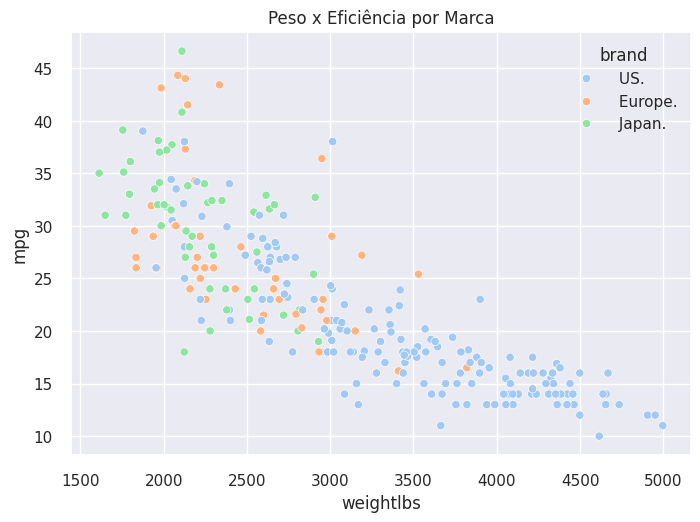

# 🧹 Data Preprocessing
Este módulo foca na **preparação e exploração dos dados**, etapa fundamental de qualquer projeto de Machine Learning.

## 📘 Objetivos
- Ler, compreender e limpar conjuntos de dados.
- Tratar valores ausentes, duplicados e inconsistentes.
- Padronizar escalas e converter variáveis categóricas.
- Explorar relações entre variáveis por meio de visualizações.

## 🧠 Ferramentas
`Pandas` · `NumPy` · `Matplotlib` · `Seaborn`

## 🚧 Status
📓 **Notebook disponível:**  
[➡️ data_preprocessing.ipynb](./data_preprocessing.ipynb)

✔️ Conversão de tipos incorretos (`cubicinches`, `weightlbs`)  
✔️ Padronização de variáveis contínuas com `StandardScaler`  
✔️ Codificação de `brand` via `OneHotEncoder`  
✔️ Dataset exportado: `cars_preprocessed.csv`

