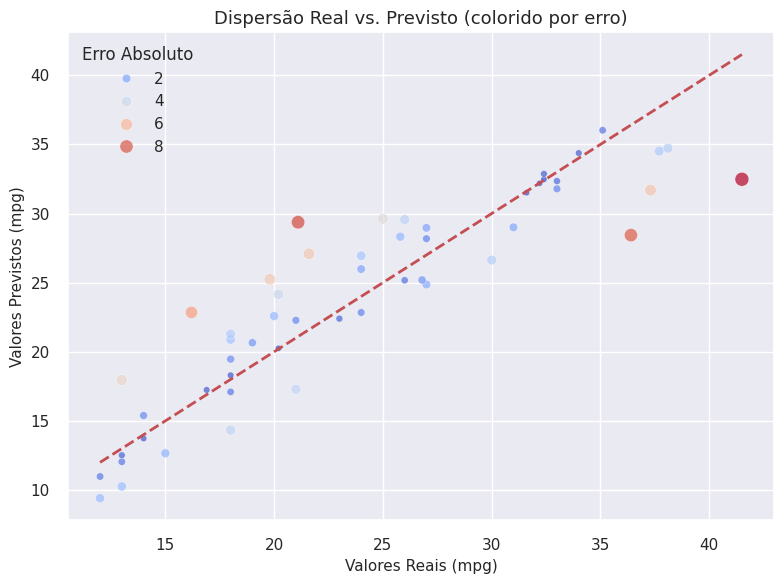

# 📈 Supervised Learning
Neste módulo, aplico algoritmos de **aprendizado supervisionado** para resolver problemas de regressão e classificação.

## 📘 Objetivos
- Construir e avaliar modelos preditivos com dados rotulados.
- Comparar desempenho entre algoritmos lineares e não lineares.
- Interpretar métricas de desempenho: R², RMSE, MAE, AUC, precisão e recall.
- Ajustar hiperparâmetros e prevenir overfitting.

## 🧠 Ferramentas
`scikit-learn` · `Pandas` · `Matplotlib`

## 🚧 Status
📓 **Notebook disponível:**  
[➡️ Supervised Learning — Linear Regression](./supervised-learning_cars.ipynb)

✔️ Tratamento automático da coluna duplicada `remainder__mpg`  
✔️ Modelo de Regressão Linear treinado e avaliado  
✔️ Visualização entre valores reais e previstos  
✔️ Dataset: cars_preprocessed.csv

