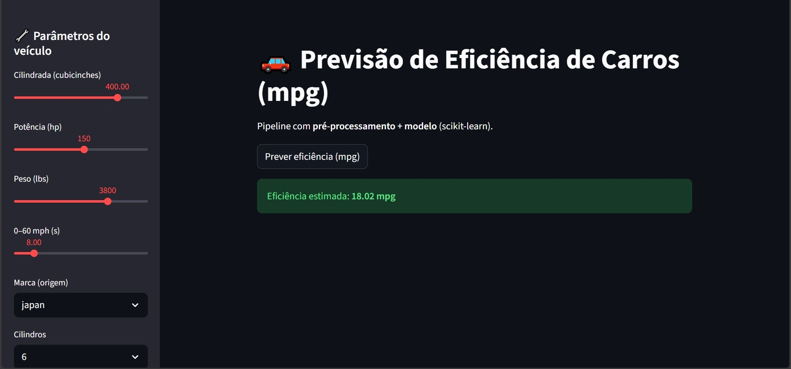

# 🚗 Model Deployment — Car Efficiency Predictor

🚀 **Aplicação publicada:** [Streamlit Cloud](https://eficiencia-carros-by-ari-soares.streamlit.app/)

📍 **App:** [app.py](./app.py)  
📦 **Pipeline:** [pipeline.pkl](./pipeline.pkl)  
🧩 **Transformer:** [custom_transformers.py](./custom_transformers.py)

---

### 🎯 Objetivo
Transformar o modelo de regressão linear desenvolvido no módulo **Supervised Learning** em uma aplicação interativa construída com **Streamlit**, pronta para uso e deploy.  
O projeto demonstra o ciclo completo de Machine Learning — do pré-processamento à entrega de valor para o usuário final.

---

### 🧠 Tecnologias e Arquitetura

| Camada | Ferramentas | Descrição |
|:--|:--|:--|
| **Modelagem** | `scikit-learn`, `pandas`, `numpy` | Treinamento do pipeline com regressão linear e escalonamento de variáveis |
| **Serialização** | `joblib` | Salvamento e carregamento do modelo e metadados |
| **Interface** | `Streamlit` | Aplicativo interativo para entrada de dados e previsão |
| **Pré-processamento customizado** | `custom_transformers.py` | Limpeza automatizada da variável categórica `brand` |

---

### ⚙️ Estrutura de Diretórios
```
04_model-deployment/
│
├── app.py                   # Aplicativo Streamlit (interface)
├── train_pipeline.py         # Treino e salvamento do pipeline
├── pipeline.pkl              # Modelo treinado e serializado
├── schema.joblib             # Estrutura das features
├── custom_transformers.py    # Classe CleanBrandTransformer (pré-processador)
├── requirements.txt          # Dependências do projeto
└── assets/
    └── app_screenshot.png    # Imagem ilustrativa do app em execução
```

---

### 📊 Funcionamento

1. O arquivo [`train_pipeline.py`](./train_pipeline.py) treina o modelo a partir do dataset `cars.csv`, localizado em `01_data-preprocessing/`.
2. O pipeline inclui:
   - Padronização de variáveis numéricas (`StandardScaler`);
   - Codificação de variáveis categóricas (`OneHotEncoder`);
   - Passagem direta de colunas contínuas (cylinders, year);
   - Pré-processamento textual via `CleanBrandTransformer`.
3. O modelo e o schema são salvos com `joblib` e carregados pelo [`app.py`](./app.py).
4. O app Streamlit permite ajustar variáveis como potência, peso e ano, retornando a eficiência estimada (`mpg`).

---

### 🧩 Classe Customizada: `CleanBrandTransformer`

O arquivo [`custom_transformers.py`](./custom_transformers.py) garante consistência entre treino e predição:

```python
class CleanBrandTransformer(BaseEstimator, TransformerMixin):
    def fit(self, X, y=None):
        return self
    def transform(self, X):
        X_ = X.copy()
        X_['brand'] = (
            X_['brand']
            .astype(str)
            .str.strip()
            .str.replace('.', '', regex=False)
            .str.lower()
        )
        return X_
```

Essa abordagem elimina diferenças sutis como `"US."` vs `"us"` e assegura estabilidade no deploy.

---

### 🖼️ Exemplo Visual


> Interface desenvolvida com Streamlit — o usuário insere parâmetros do veículo e obtém uma previsão instantânea de eficiência (mpg).

---

### ✅ Status
**Concluído** — pipeline funcional, app interativo e arquitetura consistente.  
**Próximo módulo:** [05_projects/](../05_projects/)

---

📌 *Desenvolvido por **Ari Soares** — Machine Learning Portfolio*  
🧠 *"Do pré-processamento ao deploy de modelos."*
